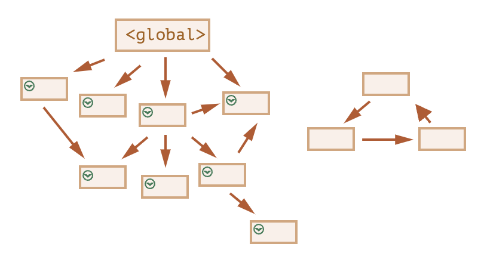

## References:
1. [Youtube](https://www.youtube.com/watch?v=EerdGm-ehJQ)
2. [GitHub](https://github.com/SuperSimpleDev/javascript-course/tree/main)
3. [MDN](https://developer.mozilla.org/en-US/docs/Learn/JavaScript)


## JavaScript Basics
- Write and run JS in the web browser by using the Console: Right click -> Inspect -> Console

- JS is giving instructions to the computer. e.g.: 
(1) `alert('hello');`: Display a message in a pop-up window
(2) Math
(3) `document.body.innerHTML = 'hello';`: Modify the web page (see DOM for more details)
(4) `typeof 'hello'`: Return type of a value
(5) `console.log('hello')`: Output a message to console

- Semicolon means the end of an instruction, we can write two instructions in the same line as long as we use semicolon between them! If we write one instruction per line, we can choose not to include semicolon because JavaScript automatically inserts semicolon at the end of the line! However, it is still a good practice to mannually insert semicolon at the end of an instruction!


## Numbers and Math
- Order of Operations (Precedence): (1) () (2) * / (3) + - 

- Inaccuracy with floats: Computer stores and processes data in binary form so that it cannot store and process **some** floats (decimal numbers) properly! e.g. The binary number of 0.25 is 0.01, but the binary number of 0.1 is 0.000110011... and 0.2 is 0.00110011...! Thus the result of 0.1 + 0.2 is weird! 

- We can solve this inaccuracy when calculating the money: 1. Convert the money to cents before calculating (* 100) 2. Convert the final result to dollars (/ 100)! This works when the money is in dollar and only has two decimal places, thus converting to cents make the money an integer! Since computers can store integers properly, there is no inaccuracy when calculating with integers!!!     
(1) Items (cost of items before shipping and taxes): (price1 * 100 * num1 + price2 * 100 * num2 + ...) / 100
(2) Total before tax: (price1 * 100 * num1 + price2 * 100 * num2 + ... + shipping * 100) / 100
(3) Tax (10%): Math.round((price1 * 100 * num1 + price2 * 100 * num2 + ... + shipping * 100) * 0.1) / 100. We use Math.round before dividing by 100 to keep 2 decimal places!   
(4) Order total: (price1 * 100 * num1 + price2 * 100 * num2 + ... + shipping * 100) / 100 + Math.round((price1 * 100 * num1 + price2 * 100 * num2 + ... + shipping * 100) * 0.1) / 100   

- Some Math methods:
  1. Round to nearest integer: `Math.round();`
  2. Round down: `Math.floor();`
  3. Round up: `Math.ceil();`


## String
- Concatenation:  `'some' + 'text'; // 'sometext'`   

- Type coercion: (1) `'hello' + 1 + 2; // 'hello12'` (2) `'25' + 5; // '255'`, `'25' - 5; // 20`   

- Create a string: 
(1) Single quote '', useful when there exists double quote inside the string, e.g. 'I"m OK'! If we still want to include double quote inside the double quote string, we can use escape character \", e.g. "I\"m OK"! Note that single quote string is recommended, please use it by default!   

(2) Double quote "", useful when there exists single quote inside the string, e.g. "I'm OK"! If we still want to include single quote inside the single quote string, we can use escape character \', e.g. 'I\'m OK'!    

(3) Backticks ``, also called template string/literal!!!    

- Template string (`...`) has two features: 
(1) Interpolation: Insert value directly into a string using `${}`!!! e.g. `Items (${1 + 1})`, this is cleaner than concatenation 'Items (' + (1 + 1) + ')'!   
(2) Multi-line strings: Allow a string with multiple lines! e.g. `some   
text`, this is the same as 'some\ntext'! This feature can be helpful when writing and formatting HTML code inside template string (see DOM for more details)!   

- String methods: https://www.w3schools.com/js/js_string_methods.asp. Note that JavaScript has a feature called 'Auto-Boxing' that automatically wraps the string into a wrapper object, thus string can also have methods!


## How to insert JavaScript
- [Reference](https://www.w3schools.com/js/js_whereto.asp):
  1. External JS: `<body><script src="script.js"></script><body>`
  2. Internal JS: `<body><script>...</script></body>`
  3. Inline JS: `<button onclick="..."></button>`

- **External and Internal JS run first (when the page is loaded or refreshed), Inline JS runs after (when we click the button)! Note that refresh the page = reload the page!!!**


## JavaScript Comment
```javascript
// This is a single-line JS comment
/*
This is a multi-line JS comment
*/
```


## Variables
- 3 ways to create variables:   
  1. `let` creates a variable whose value will be re-assigned! We can choose not to assign a value when creating the variable (declaration without initialization)!   
  2. `const` creates a constant variable whose value can't be re-assigned! We must assign a value when creating the variable (declaration with initialization)! Please always use `const` by default!!!   
  3. `var` creates a variable whose value can be changed, it is used in older JS code, not recommended!     
  They also differ in Scope, see Scope for more details!

- Variable name restrictions: 
  1. Can't use reserved words like 'let', 'const' 
  2. Can't start with a number 
  3. Can't use special characters except '$' and '_'   

- Naming Conventions: 
  1. camelCase, standard for JavaScript! 
  2. PascalCase, used for things that generate objects, e.g. Class! 
  3. kebab-case 
  4. snake_case

- A variable can have value, there are 8 types of values: 
  1. Number 
  2. String 
  3. Boolean 
  4. Null, only has one value `null` 
  5. Undefined, only has one value `undefined` 
  6. Symbol 
  7. BigInt 
  8. Object   
  
  The first 7 are primitive data types that are immutable! All primitives (except Null) can be tested by `typeof` operator. `typeof null` returns `object`, so we should use `=== null` to test for Null!   

  JavaScript has a feature called 'Auto-Boxing' that automatically wraps the primitives into wrapper objects which provide useful properties and methods! Thus primitives behave like they have properties and methods! This applies to all primitives except Null and Undefined!!!      

  undefined vs. null   
  'undefined' indicates the absence of a value! 'null' indicates the absence of an object (make up an excuse for `typeof null === 'object'`)! The difference between 'null' and 'undefined' is minor, 'null' is used much less often than 'undefined'!   

  Object is a non-primitive data type that is mutable! Note that Functions and Arrays are Objects in JavaScript!!!


## Booleans
- Boolean values: (1) `true` (2) `false`

- Comparison operators '===' vs. '==': '==' tries to convert both values into the same type and then compare them, e.g. 5 == '5' is true!!! Thus we always use '===' and '!==' to check if two values are the same!

- Logical operators: '&&', '||', '!'. Note that if you want to check if a number is inside a range, always use '&&', don't use chained comparison! e.g. 0 <= 0.2 < 1/3 is false! This is because it is evaluated from left to right, 0 <= 0.2 is true, thus it becomes 1 (type coercion) in order to proceed with the next comparison! Since 1 < 1/3 is false, the final result is false!   

- Precedence: 1. () 2. * / 3. + - 4. Comparison operators 5. Logical operators

- Falsy value: behaves just like false! (1) false (2) 0 (3) '' (4) NaN (Not a Number), this is a special kind of Number value! We get NaN when we do some invalid math! e.g. 'text' / 5 is NaN (5) undefined, something doesn't have a value! e.g. let variable1, variable1 is undefined! (6) null, works the same as undefined in most cases, but we use null when we intentionally want something to be empty! e.g. If we pass undefined to the function, then parameter will have default value or undefined! If we pass null to the function, then parameter will always have null!     

- Truthy value: behaves just like true! All values other than falsy values!


## If Statement
- Syntax
```javascript
if (...) {
    ...
} else if (...) {
    ...
} else {
    ...
}
```

- Shortcut (write if-statement in a single line)
1. Tenary Operator `?`    
`condition ? operation1 : operation2`, same as:
```javascript
if (condition) {
    operation1;
} else {
    operation2;
}
```
`const result = condition ? value1 : value2`, same as:
```javascript
let result;
if (condition) {
    result = value1;
} else {
    result = value2;
}
```

2. Guard Operator `&&`   
`condition && operation`, same as:
```javascript
if (condition) {
    operation;
}
```
`const result = value1 && value2`, same as:
```javascript
let result;
if (value1) {
    result = value2;
} else {
    result = value1;
}
```

3. Default Operator `||`   
`condition || operation`, same as:
```javascript
if (!condition) {
    operation;
}
```
`const result = value1 || value2`, same as:
```javascript
let result;
if (value1) {
    result = value1;
} else {
    result = value2;
}
```


## Scope 
Scope limits where a variable exists, it helps us avoid naming conflicts!   
```javascript
{
    let x = 2;
    {
        // x can be used here!
    }
}
// x can NOT be used outside {}!

let y = 3; // y is a global variable that can be used everywhere!
```
Based on the above example, (1) If we use 'let' or 'const' to create a variable outside {}, we can still access that variable inside {}. (2) If we use 'let' or 'const' to create a variable inside {}, we cannot access that variable outside {}. (3) We can use 'let' or 'const' to create two variables with the same name! One outside {} and one inside {}, these two variables don't affect each other!    

However, these rules only apply to 'let' and 'const'! For 'var', if we use 'var' to create a variable inside {}, this variable can still be accessed outside {}! That's why we shouldn't use 'var'!


## Function
Functions are first-class Objects with the additional capability of being callable! Function can help us reuse the code!    

### Regular functions
```javascript
functionName(argumentList); // Hoisting! We can call the function before its declaration! 
function functionName(parameterList) {
    // functionBody, note that function can also have a return value!
}
functionName(argumentList); // Call the function (run the code inside)
```

Functions are values (because they are objects), so that we can save a function inside a variable:
```javascript
// Hoisting doesn't work!
const functionName = function f1(parameterList) {
    // functionBody
}
functionName(argumentList); // Call the function using the variable name!
```

Note that when we save a function inside a variable, function name is not needed because we can use that variable name to call the function. Thus we can create an anonymous function:
```javascript
// Hoisting doesn't work!
const functionName = function(parameterList) {
    // functionBody
}
functionName(argumentList); // Call the function using the variable name!
```

### Arrow functions
Mostly work the same as regular functions! Note that arrow functions are always anonymous!!!      
```javascript
// Hoisting doesn't work!
const functionName = (parameterList) => {
    // functionBody
}
functionName(argumentList); // Call the function using the variable name!
```

Shortcuts:
(1) If only one parameter, we can remove the parentheses: `const functionName = param => {...}`
(2) If function body only has one line, we can put everything on the same line! We can also remove the curly brackets (and the 'return' keyword if exists): `const functionName = (parameterList) => ...;`

### Closure 
A **closure** is the combination of a function and the lexical environment within which that function was declared. Usually the inner function and the variables declared around it form a closure, so that the inner function always have access to those variables! Closure is created every time a function is created at function creation time!
```js
function outer() {
    const name = 'Liam';
    
    function inner() {
        console.log(`hello ${name}`);
    }

    return inner;
}
const myFunc = outer();
myFunc(); // 'hello Liam'
```
In the above example, `myFunc` is a reference to the instance of function `inner` that is created when function `outer` is run. The instance of `inner` maintains a reference to its lexical environment, within which the variable `name` exists. For this reason, when `myFunc` is invoked, the variable `name` remains available for use!


## Callback
Since functions are values, a function can be an object's property value, see Object for more details! A function can also be another function's argument, we call "A function passed into another function as an argument" a **Callback Function (Callback)**, then we call 'A function that accepts a function as an argument' a **Higher Order Function**!!!        

Note that arrow functions are recommended to use when creating callbacks because they are easier to read! So that for all the following examples, I use arrow functions, but regular anonymous functions work the same!!!     

**Suppose higher order function doesn't provide parameter to callback**, e.g. `setTimeout`, `setInterval`      

1. No predefined callback
If there is no predefined callback, we should pass the whole callback into the higher order function!   
```javascript
higherOrderFunction(() => {
    // ...
})
```

2. Predefined callback without parameter
```javascript
const callback = () => {
    // ...
}

higherOrderFunction(() => { // Solution 1
    callback();
})

higherOrderFunction(callback); // Solution 2, it should not be callback() because calback() is the return value of executing callback, but we just want to pass this function itself! Note that when passing the function name, we actually pass the reference to callback!
```

3. Predefined callback with parameter
```javascript
const callback = (parameter) => {
    // ...
}

higherOrderFunction(() => {
    callback(argument);
})

// This is wrong because higher order function doesn't provide parameters, thus 'parameter' will be 'undefined'!
higherOrderFunction(callback);
```

**Suppose higher order function provides parameter to callback**   

Some higher order functions provide parameter to callback, e.g. `forEach`/`filter`/`map` provides 'value, index, array' and `addEventListener` provides 'event'! You can choose not to use these parameters or only part of these parameters! The parameter names don't matter, but the order of these parameters matters!    

Always keep in mind that the parameters of the callback are determined by the higher order function!!!     
  
1. No predefined callback
(1) If callback function body doesn't need parameter provided by higher order function:
```javascript
higherOrderFunction(() => {
    // ...
})
```
(2) If callback function body needs parameter provided by higher order function:
```javascript
higherOrderFunction((parameter) => {
    // ...
})
```

2. Predefined callback without parameter
```javascript
const callback = () => {
    // ...
}

// Solution 1
higherOrderFunction(() => {
    callback();
})

// Solution 2
higherOrderFunction(callback);
```

3. Predefined callback with parameter
(1) If parameter is not provided by higher order function:
```javascript
const callback = (parameter) => {
    // ...
}

higherOrderFunction(() => {
    callback(argument);
})
```

(2) If parameter is provided by higher order function:
```javascript
const callback = (parameter) => {
    // ...
}

// Solution 1
higherOrderFunction((parameter) => {
    callback(parameter);
})

// Solution 2
higherOrderFunction(callback);
``` 


## Object
Object is the only non-primitive data type that is mutable!!! Object can make the code more organized by grouping multiple values together!    

```javascript
// It is a common practice to create object with const, we can update/create/delete the property of the object value, but we cannot re-assign a value!!!
const object = {
    property: value,
    // property-value pairs, separated by ','!
};
object.property; // access the property's value (dot notation), note that we always use dot notation by default!
object['property']; // access the property's value (bracket notation), only useful when dot nation doesn't work! e.g. object.first-time has syntax error because of '-', we can only use object['first-time']!
object.property = ...; // update the value of an existing property or create a new property-value pair if the property doesn't exist
delete object.property; // delete a property-value pair
```

**JavaScript Object keys can be Strings and Symbols!!!**  

Note that property value can be any data type, including another object and even function!   
```javascript
const object = {
    // Nested Object (object inside object)
    rating: {
        stars: 4.5,
        count: 87
    },
    // Method (function inside object)
    method1: function function1(name) {
        console.log(`hello ${name}`);
    },
    method2: function(name) {
        console.log(`hi ${name}`);
    },
}
object.rating.stars; // Chained dot notation
object.method1('Liam'); // Call the funtion (method) using the property name!
object.method2('Liam'); // Call the function (method) using the property name! Note that function name is not needed because we use property name to call the function. Thus we can create an anonymous function!
```
Similarly, "console" and 'Math' are objects, "log" and 'random' are their functions (methods)!   

**Objects are references!**   
(1) When we create a variable `const obj1 = {...}`, `obj1` doesn't get the object value, instead it gets a reference that points to the actual object value in the computer's memory! 'const' only makes the reference constant, thus we cannot update the reference (e.g. re-assign a value), but we can update the value it points to (e.g. update property)!   

(2) When we assign an object to another object `const obj2 = obj1`, we just copy the reference, both variables get the same reference that points to the same location (so that same value)! Thus when we update obj1, obj2 also changes!   

(3) When we compare two objects, `const obj3 = {...}`, suppose obj3 has the same value as obj1, `obj3 === obj1` is still false because '===' compares the references and obj1 and obj3 have different references that point to different locations with the same value! `obj2 === obj1` is true because they have the same reference! If we want to check if two objects have the same value, we should manually check their property values one by one!


**Shortcuts**
(1) Destructuring: `const { property1, property2, ... } = object`, this is the same as `const property1 = object.property1; ...`

(2) Shorthand Property: 
```javascript
const object = {
    message
}
```
This works when property value is a variable that has the same name as property! This is the same as:
```javascript
const object = {
    message: message
}
```

(3) Shorthand Method:
```javascript
const object = {
    method() {
        ...
    }
}
```
This is the same as:
```javascript
const object = {
    method: function functionName() {
        ...
    },
    // OR
    method: function() {
        ...
    }
}
```

**Tricks**
1. Dynamic Object Property: Use brackets to wrap string (variable or expression) and use it as JS object property!
2. Optional Chaining `?.`: Return 'undefined' instead of throwing an error if doesn't exist!


## JavaScript built-in Object
- console: e.g. console.log(), display a message in a pop-up window

- Math: e.g. Math.random(), generate a random number that is greater than or equal to 0 and less than 1

- JSON (JavaScript Object Notation): similar to JavaScript Object with less features: (1) All the properties and String values must use double quotes! (2) Function cannot be the property's value! JSON syntax is more universal, we use it when we send data between computers and when we store data! 
  1. `const jsonString = JSON.stringify(value)`, convert JavaScript value (e.g. Object) to JSON String, value itself doesn't change!  
  2. `const value = JSON.parse(jsonString)`, convert JSON String to JavaScript value (e.g. Object), jsonString itself doesn't change!

- localStorage: **When the page is loaded or refreshed, Internal or External JavaScript code between `<script></script>` is re-executed from the beginning**, thus all the variables are re-initialized! We want to store the values of the variables more permanently even after closing and re-openning the page or refreshing the page!!!   
  
  1. `localStorage.setItem('key', JSON.stringify(value))`, store the 'value' of JSON String type into local storage, we can access this JSON String by using `localStorage.getItem('key')` even after closing and re-openning the page or refreshing the page! Note that we only use 'JSON.stringify' when 'value' is not a String because localStorage only supports String! **Note that we use `.setItem` whenever there is an update on 'value'!**    
  
  2. `const value = JSON.parse(localStorage.getItem('key')) || default value`, when initializing the variable at the beginning, it should either be retrieved from local storage or have a default value (if doesn't exist in local storage)! Note that we only use 'JSON.parse' when we use 'JSON.stringify'! Note that we include `|| default value` because when the page is first loaded, there is nothing in local storage! Also, if we use `.removeItem` and then close and re-open the page or refresh the page, there is also nothing in local storage!      
  
  3. `localStorage.removeItem('key')`, if the program has a reset or clear function, we can implement it by (i) reset the value and (ii) remove it from local storage     

  See Lesson 8 "rock-paper-scissors.html" for more details!

- document/window, see below


## DOM (Document Object Model)
The Document Object Model (DOM) represents the web page as a tree of objects, which enables JavaScript to change the structure, style, and content!

1. `document.title`, get or change the page's title, its type is String!

2. `document.body`, get all the html between `<body>` and `</body>` (inclusive), its type is Object! Normally we use `document.body.innerHTML` to get or change all the html between `<body>` and `</body>` (exclusive), its type is String! It means that if we want to change the inner HTML between body tags, we should write the html code in quotes! e.g. `document.body.innerHTML = '<button onclick="alert(\'suprise\')">Click</button>'`, note that we use escape character `\'` because we include single quote inside single quote!

3. `document.querySelector('tag')`, get all the html between the **first** `<tag>` and `</tag>` (inclusive), its type is Object! Similar to (2), we normally use `document.querySelector('tag').innerHTML` to get or change all the html between the **first** `<tag>` and `</tag>` (exclusive), its type is String. e.g. `document.querySelector('button').innerHTML` can get the value on the button!

4. Similar to (3), `document.querySelector('.className')`, get all the html between the **first** element with class = "className" (inclusive), `document.querySelector('#idName')`, get all the html between the element with id = "idName" (inclusive)!

5. If the tag is `<input>`, then there is only one tag since there is no `</input>`, we can use `document.querySelector('input').value` to get the input value, its type is String! We can use `Number(...)` to convert a string to a number and `String(...)` to convert a number to a string!   

**The document object represents the web page, while the window object represents the whole browser!** e.g. window.document, window.console, window.alert, but we don't have to type 'window.'!   


## CSS + JavaScript
The above DOM tells us how to change the HTML using JavaScript, but how to change the CSS?

1. Create a new CSS style **below** the old CSS style, only include the property-value that you want to overwrite the old CSS style!

2. Check if an element contains the new CSS style: `.classList.contains('newClassName')`, e.g. `document.querySelector('button').classList.contains('newClassName')`

3. Add the new CSS style: `.classList.add('newClassName')`, the element has a new CSS style which overwrites the old CSS style! Note that adding duplicate class will only result in one class since 'add' doesn't allow duplication!

4. Remove the new CSS style: `.classList.remove('newClassName')`, the element returns to the old CSS style! Note that if we want to remove a class, we don't have to first check if this class exists and then remove it! Because 'remove' removes a class if it exists and does nothing if it doesn't exist!


## Event Listener/Handler
1. Inline code   
  - onclick: often used in `<button>`, what will happen when clicking the button     
  - onkeydown: often used in `<input>`, what will happen when typing in the input box, usually we write `onkeydown="if (event.key === 'Enter') { submit(); }"` so that pressing Enter is the same as clicking the submit button! Note that `event` is an object provided by every event listener!    

2. Instead of writing inline JS code, it is recommended to use `addEventListener(type, listener)`, 'listener' is a callback! e.g. 
```javascript
document.querySelector('button').addEventListener('click', function(event) {...})
```
Similar to `.forEach`, `.filter`, and `.map`, `addEventListener` provides an 'event' object to callback, you can choose not to use this parameter! The parameter name doesn't matter!      

Advantages: (1) Add multiple event listeners to an event (2) Remove a specific event listener using `.removeEventListener(type, listener)`, this only works when we add and remove the event listener using the same predefined function name!


## Array
Array is a sprcial type of Object, it represents list of values. 

- Create an array: `const array = [item1, item2, item3];`, since array is a sprcial type of object, it is a common practice to create an array with 'const', we can still update it, but we cannot re-assign a value! Items can be of different data types!

- Get or change an array element: `array[index] = ...`, 'index' can be 0 to 'array.length - 1'!

- Array methods:
  - `array.length`: return number of elements in an array
  - `array.push(value)`: add value to the end of the array
  - `array.splice(index, number)`: remove #number elements starting at `array[index]`!   

  - `array.forEach(function(value, index, array) {...})`: execute the provided function on each array element!
  - `const newArray = array.filter(function(value, index, array) { return condition })`: create a new array, execute the provided function on each array element and add elements that pass the test (i.e. elements that can make 'condition' true!) to new array!
  - `const newArray = array.map(function(value, index, array) { return newValue })`: create a new array, execute the provided function on each array element and add the return value to new array!   

  Note that `.push` and `.splice` modify the original array, `.forEach`, `.filter`, and `.map` don't modify the original array!    
  Also note that similar to `.addEventListener`, `.forEach`, `.filter`, and `.map` provide 'value' (item value), 'index' (item index), and 'array' (the whole array) to callback, you can choose not to use these parameters or only part of these parameters! The parameter names don't matter, but the order of these parameters matters!    

- Loop through an array
  - For/While Loop: e.g. `for (let i = 0; i < array.length; i++) { // array[i] }`
  - forEach:    
  ```javascript
  array.forEach(function(value, index, array) {...});
  ```   
  It is a preferred way to loop through an array! Note that we cannot use 'continue' and 'break' in forEach, instead, we can use 'return' in callback which works the same as 'continue' to skip 1 iteration! However, there is no good alternative of 'break', thus if we want to use 'break', then it's better to use for loop or while loop!

- Arrays are references! See Objects for more details!!!   
`const array2 = array1` is "copy by reference", both arrays point to the same location (so that same value)! Thus when we update array2, array1 also changes! `const array3 = array1.slice()` is "copy by value", both arrays point to different locations with the same value! Thus when we update array3, array1 doesn't change! 

- Shortcut
Destructuring: `const [firstValue, secondValue, ...] = array`, this is the same as `const firstValue = array[0]; const secondValue = array[1]; ...`
Note that Destructuring Assignment is a very important feature introduced in ES6, we can even use it to **swap values of two variables without a temporary variable**: `[a, b] = [b, a]`!!! 


## Loop
- While Loop
```javascript
// create loop variable
while (loop condition including loop variable) {
    // loop body including increment step
}
```

- For Loop
```javascript
for (create loop variable; loop condition; increment step) {
    // loop body
}
```

For a standard loop, we prefer for loop, for a non-standard loop, we prefer while loop! e.g.
```javascript
let randomNumber = 0;
while (randomNumber < 0.5) {
    randomNumber = Math.random();
}
```
This can also be written using for loop!   

- Break vs. Continue    
(1) `break`: exit the loop early; Similarly in a function, we can use `return` to exit the function early!   
(2) `continue`: skip 1 iteration of the loop; Similarly in `array.forEach`, we can use `return` in callback to skip 1 iteration!   
Note that `continue` in while loop can skip the increment step, so we also have to add the increment step before continue! However, this is not a problem in for loop because increment setp is done automatically!


## Modules
- Normally we write separate JavaScript files and load them one by one. This is actually the same as combining all the JavaScript files together into one big file! If we create duplicate variable names in separate files, then it can cause naming conflicts!   

  To fix this issue, we can use modules to better organize the code:    
  1. `<script type="module" src="..."></script>`
  2. Export functions or variables
  3. Import functions or variables 
  A module is just a piece of code in a file that can be used in other files. When developing a big project, it is very useful to divide the code into modules instead of combining all the code in one single file!   
   
- Export and Import
  1. Default Exports (A module can have at most one default export):
  module.js: `export default module`   
  app.js: `import anyName from './module.js'`, name after 'import' can be any name you want!
  
  2. Named Exports (A module can have multiple named exports):
  module.js: `export const name = 'liam; export function func(name) {...}`   
  app.js: `import { name, func } from './module.js'`, name inside {} has to be the same name in module.js!

  Note that Modules only work with HTTP(s) protocol, so that we should open the HTML using Live Server! We shouldn't directly open the HTML with web browser! 


## External Libraries
External Libraries are just code written outside of our project, we generally load them first by using `<script src="..."></script>`, so that we can use them in other Javascript files!    

However, loading multiple script files can cause naming conflicts, so that we should use module! To use module, we can load the ESM version of external library as module in other JavaScript files instead of using script tags in HTML file!    

See their documentation for more datails!   


## Asynchronous Programming
- Asynchronous vs. Synchronous
(1) Synchronous code: will wait for a line to finish before going to the next line, most codes we write are synchromous so that they run one by one!

(2) Asynchronous code: won't wait for a line to finish before going to the next line, e.g.
```javascript
setTimeout(function() {
    console.log('timeout');
}, 2000); // This function will run after 2000ms, but we won't wait for it to finish, we immediately go to the next line!

console.log('next line'); // This code runs first!

setInterval(function() {
    console.log('interval');
}, 2000); // This function will run after 2000ms and keeps running every 2s! But we won't wait for it to finish, we immediately go to the next line!

console.log('next line 2'); // This code runs second!
```

(3) A practical example to auto play a game and stop it:
```javascript
let isAutoPlaying = false;
let intervalId;
function autoPlay() {
    if (!isAutoPlaying) {
        intervalId = setInterval(playFunc, interval); // Not playFunc()!
        isAutoPlaying = true;
    } else {
        clearInterval(intervalId); // Stop auto play! Similarly we have clearTimeout()!
        isAutoPlaying = false;
    }
}
```

- Promise
https://www.runoob.com/js/js-promise.html
https://developer.mozilla.org/zh-CN/docs/Web/JavaScript/Guide/Using_promises

- Async/Await

See asynchronous.js!


## Object Oriented Programming
Normally we use Procedual Programming to organize the code into functions, this is a top-down approach. However, we can also use Object Oriented Programming to organize the code into objects, this is a bottom-up approach! 

We can use OOP by grouping variables as properties (attributes) and functions as shorthand methods into an object!

**`this`**
The `this` keyword refers to the context where a piece of code is supposed to run. Most typically, it is used in object methods, where `this` refers to the object!

The value of `this` in JS depends on how a function is invoked, not how it is defined! When a regular function is invoked as a method of an object, `this` refers to that object. When a regular function is inboked as a standalone function, `this` refers to the global object (non-strict mode) or 'undefined' (strict mode)!

https://developer.mozilla.org/en-US/docs/Web/JavaScript/Reference/Operators/this

**Class**
Class is used to better generate objects in OOP! A class is actually a template for creating objects, so that it also has properties and methods inside! 

Class provides additional features for OOP:
(1) Constructor: a special method to initialize properties of the class
(2) Private properties and methods: can only be accessed inside the class

https://www.w3schools.com/js/js_classes.asp
https://developer.mozilla.org/en-US/docs/Web/JavaScript/Reference/Classes

**Inheritance**
Inheritance lets us reuse code between classes! The child class inheris all the properties and methods from parent class!!! We use inhetitance when one class is a more specific type of another class!

```javascript
class Child extends Parent {

}
```


## ES6
1. `let` and `const`
2. Arrow functions
3. Default parameter
4. Rest parameter and Spread operator `...`
5. Template string/literal
6. Object literal
7. Destructuring assignment
8. Module
9. Class
10. Promise


## Conclusion
<!-- https://supersimple.dev/js-basics/ -->   
1: Introduce some JS basics, write some simple JS codes in the above website by using the console    

<!-- https://supersimple.dev/projects/amazon/checkout -->   
2: Introduce math and numbers in JS, calculate Items, Shipping & handling, and Estimated tax of different combinations of items in the above website, solve inaccuracies when calculating with money
3: Introduce string in JS, create texts in Order Summary   

4: Review HTML and CSS, introduce how to load JS into HTML and how to write comments   

<!-- https://supersimple.dev/projects/variables/ -->   
5: Introduce variables, implement the above project   

<!-- https://supersimple.dev/projects/booleans/ -->
6: Introduce booleans and if-statement, implement the above project
7: Introduce functions and improve the above project

<!-- https://supersimple.dev/projects/objects/ -->
8: Introduce objects, add a score function and use localStorage to permanently store the values

<!-- https://supersimple.dev/projects/dom/ -->
<!-- https://supersimple.dev/projects/dom-rock-paper-scissors/ -->
9: Introduce DOM and implement the above projects

<!-- https://supersimple.dev/projects/dom-with-css/ -->
<!-- https://supersimple.dev/projects/rock-paper-scissors/ -->
10: Add CSS to all the Lesson 9 projects

<!-- https://supersimple.dev/projects/arrays/ -->
11: Introduce Array and implement two practices and one project

<!-- https://supersimple.dev/projects/arrays/ -->
<!-- https://supersimple.dev/projects/advanced-functions/ -->
12: Introduce advanced functions and implement the above project

<!-- https://supersimple.dev/projects/amazon/ -->
13: Use previous knowledge to add some JS to amazon.html
14: Use modules to organize the code and create the checkout page, use localStorage to store cart!
15: Learn external libraries, finish the checkout page


TODO:
lesson 12 exercise; lesson 13l - 13m; lesson 14g - 14n
Asynchronous Programming, Object Oriented Programming