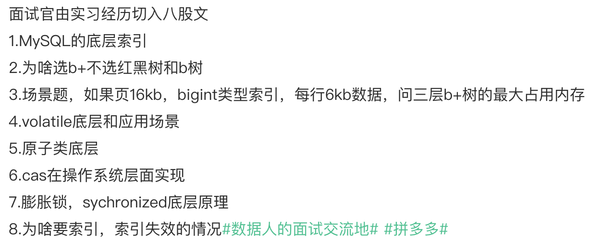
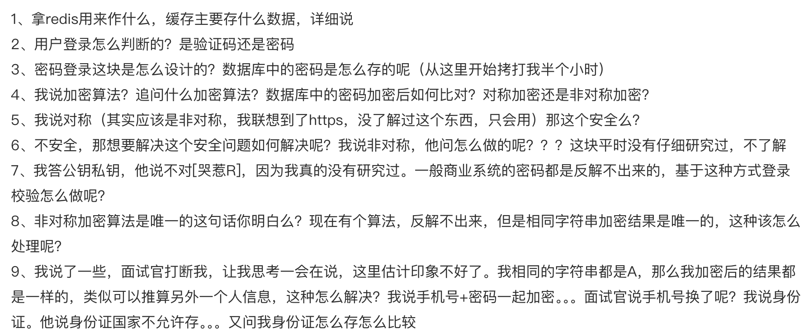
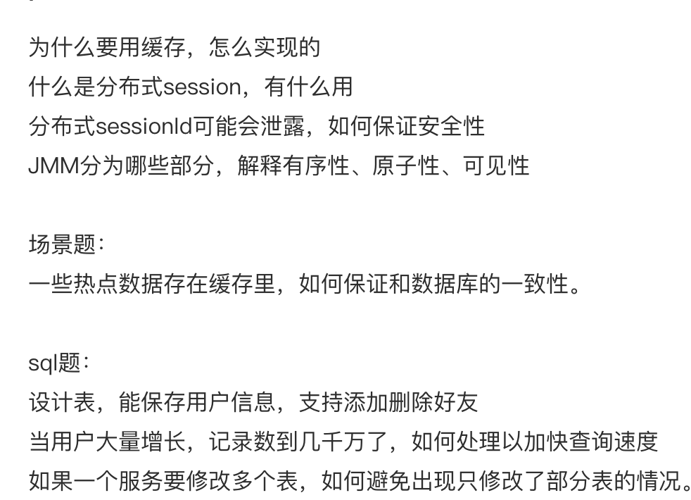
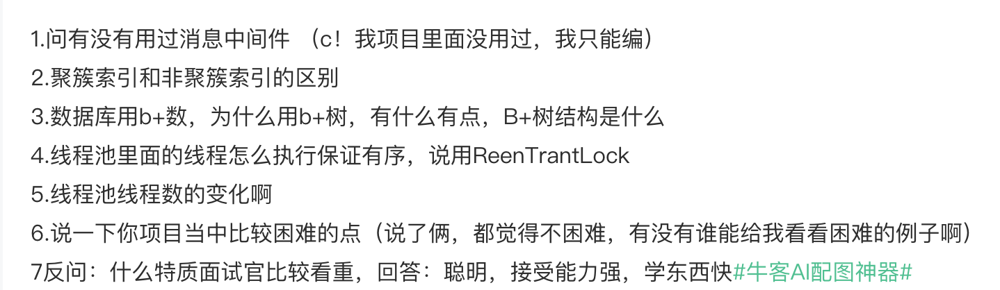

自我介绍
个人项目里面的技术难点，会围绕业务来问问题，所以技术栈及其拓展要熟悉！
实习经历着重准备！！！！
挑战性的工作？
思考为什么要用某个技术，别的不可以吗？
redis

JWT：Header(头部).Payload(负载).Signature(签名)，JWT默认不加密，不要在payload中放隐私信息！

注册：用户提供用户名、邮箱、密码，后端根据是否是第一次注册来分配权限，只有第一次注册的用户才是管理员，这样可以确保没有办法通过前端发送请求的方式来改变权限，只能在后端数据库中修改！然后将姓名、邮箱、密码、权限存储进数据库，注意，我们用bcrypt算法和一个随机生成的盐值，将密码哈希之后再存入数据库！最后将数据库中的ID、用户名和权限封装成payload，根据这个payload和密钥生成一个JWT，再将JWT存储进签名的cookie中，这样前端在接下来的每次请求时都会自动的带上这个cookie！注意cookie的设置：`httpOnly : true`确保前端无法用`document.cookie`访问，`secure : true`确保只能在https下发送，`signed : true`确保利用密钥为cookie生成了一个签名，这样下次服务端发送请求并带上cookie时，可以通过检查签名来判断cookie是否被篡改过！当然，我们也可以不用cookie，而是直接将JWT传给前端，前端将其存储进local storage，每次发出请求时，将其从local storage中取出并添加到header里面：`Authorization: Bearer <token>`;cookie的好处是更安全，后者的好处是可以跨域！

登陆：用户提供邮箱和密码，通过邮箱找到数据库中存储的哈希之后的密码，还可以得到盐值，用相同的bcrypt算法和盐值再次哈希用户提供的密码，如果与数据库中的密码相同，就登录成功！同上，封装payload，生成JWT，存储进签名的cookie中！

Authentication: verify who a user is;    
Authorization: verify what a user has access to!   

认证：在注册或者登陆之后，前端每次发送请求都会带上cookie，对于某些请求，例如查看个人信息、取消订单、创建商品、修改评论等，需要验证个人信息，在认证的中间件截取cookie和其中的JWT，通过密钥来验证JWT并获得其中的payload！

授权：OAuth 2.0，用户可以用GitHub来登录网站而不暴露自己的账号密码！用户点击使用GitHub登陆 -> 在GitHub登陆页面确认授权 -> 授权成功后跳转回前端，并带上一个code -> 前端把code发给后端 -> 后端用这个code向GitHub请求access_token -> 后端用access_token获得用户信息，就可以继续封装payload，生成JWT....

Redis: Key-Value数据库，读写速度非常快，存储临时的大量的高频的数据，提供缓存和分布式锁的功能

MySQL vs MongoDB: https://aws.amazon.com/cn/compare/the-difference-between-mongodb-vs-mysql/

NCBI PubMed
Entrez
requests，BeautifulSoup
抓取文字：pymupdf, OCR (Python-tesseract)
抓取图片：是否有蒙版mask，有的话就组合蒙版；是否有特定的色彩空间(不是RGB)，转化为RGB
Google Gemini - 多模态，免费，稳定，快

下面是一份从面试官视角，针对你前端技术岗位所进行的深度、细节化提问清单，并附带示范性回答。问题会结合你简历中提到的技术栈与项目经历，从React基本原理到前端性能优化、再到测试与部署等多维度展开，以帮助你进行更有针对性的复习与准备。回答部分仅供参考，你在真实面试时可根据实际经验和项目背景灵活发挥。

---

## 一、基础与原理

### 1. React 基本理念
**面试官提问：**  
- 你是如何理解 React 中的声明式编程以及它相比传统命令式编程的优势？  
- 虚拟 DOM（Virtual DOM）在 React 中是如何提升渲染效率的？  
- 你在项目中是如何调试和排查虚拟 DOM 导致的渲染性能问题的？

**示范回答：**  
- 声明式编程让开发者更关注数据与 UI 状态的对应关系，而不是实现这一过程的步骤。React 通过状态和组件层级的分离，让 UI 更新更加直观，减少了手动操作 DOM 的复杂度。  
- 虚拟 DOM 是 React 在内存中的一层数据结构，它会先对比新旧虚拟 DOM 树，找到差异后再定向更新实际 DOM，从而减少对真实 DOM 的大规模操作，提升整体渲染效率。  
- 在排查性能问题时，我通常会使用 React DevTools 的 Profiler 功能定位渲染次数与渲染耗时，通过查看哪些组件频繁更新来发现是否存在不必要的 re-render，比如在 Jobster 项目里曾经遇到因为 props 未经优化导致子组件频繁重新渲染的问题，后续通过使用 `React.memo` 或者将数据放入全局状态进行缓存等方式来减少重复渲染。

---

### 2. React Router 与路由管理
**面试官提问：**  
- 你在 OSU Imageomics Institute 项目中使用过 React Router，你能介绍一下它在单页应用（SPA）中的工作原理吗？  
- 你是如何处理路由懒加载和路由鉴权的？

**示范回答：**  
- 在 SPA 中，React Router 通过监听浏览器的历史记录（History API）或哈希（Hash）来实现路由跳转，而不是让浏览器进行完整的页面刷新。这样就能保留单页应用的整体加载结构并减少网络请求。  
- 在实际项目中，我会使用 React Router 的 `lazy()` 与 `Suspense` 进行路由懒加载，使得只有在用户真正访问到对应的路由时才去加载相关的组件，从而优化首屏加载速度。如果项目需要访问权限判断，会在路由层面包裹一层鉴权组件，例如对登录态进行检测或调用后端接口进行用户权限校验后，再决定是否重定向到登录页。

---

### 3. 前端数据获取与 TanStack Query（React Query）
**面试官提问：**  
- 你在简历中提到用 TanStack Query（React Query）来管理数据请求和缓存。它跟 Redux、MobX 等状态管理工具相比有什么区别和优势？  
- 你在项目中是如何配置数据缓存策略和失效机制的？

**示范回答：**  
- TanStack Query 的定位是“数据获取和缓存管理”，它能够提供对远程数据的自动缓存、失效和更新策略，这与一般的全局状态管理库（如 Redux）有所不同。Redux 更倾向于管理全局的业务逻辑状态，而 React Query 则擅长在前端对服务端数据的获取、缓存和同步。  
- 在配置数据缓存时，我会根据业务场景设置 `cacheTime` 和 `staleTime`，并在一些关键操作（例如用户手动刷新列表）后通过 `invalidateQueries` 或 `refetchQueries` 来刷新缓存。这样可以在保证响应速度的同时，保持本地数据与服务器数据的实时性。

---

## 二、性能优化

### 4. 前端性能调优思路
**面试官提问：**  
- 针对一个大型 React 项目，假设用户在高并发场景下访问，你会从哪些角度进行前端性能调优？  
- 在你的 Jobster 项目里提到“页面加载时间缩短 20%”，你是通过哪些优化策略实现的？

**示范回答：**  
- 我的前端性能调优大致包含以下几方面：  
  1. **组件级优化：** 使用 `React.memo` 或 `PureComponent` 避免组件重复渲染；拆分大型组件；使用合适的 Hooks；  
  2. **代码分割与按需加载：** 结合路由懒加载、动态 import 减少首屏包体积；  
  3. **缓存策略：** 利用 HTTP 缓存头、React Query 缓存、Service Worker（PWA）等；  
  4. **网络层优化：** 减少请求次数并进行并发请求，启用 gzip/br 压缩等；  
  5. **图像与静态资源优化：** 图片懒加载、使用更轻量的图片格式等。  
- 在 Jobster 项目中，我们主要做了两点：  
  1. **引入 Vite** 替换原本的 Webpack 以获得更快的构建和热更新速度；  
  2. **配合 GitHub Actions** 做自动化构建和代码分割，将最终产物部署到 CDN 上，这样可以在全球范围内获得更快的响应速度。进一步还通过编写自定义 Hooks 来缓存和复用某些复杂计算结果，从而减少重复的逻辑运算与渲染。

---

### 5. 前端监控与可观测性
**面试官提问：**  
- 你提到在高并发情况下要对应用进行优化，那如何监控前端的性能与错误？  
- 你会使用哪些工具或方法去收集并分析性能数据？

**示范回答：**  
- 我通常会搭建前端监控和埋点系统，采用第三方服务例如 Sentry、Datadog 或者阿里云、AWS 提供的前端监控工具来记录 JavaScript 异常、资源加载错误、网络请求错误以及页面性能指标（如 FP、FCP、TTI 等）。  
- 对于分析性能数据，我会结合Chrome DevTools 的 Performance、Lighthouse 等工具定期做性能审计，并对比核心指标的历史数据走势。如果是内部系统，还会结合自定义埋点上报关键路径的耗时，例如 API 请求耗时、页面初次渲染时间等，并配合时序数据库或日志服务进行可视化分析。

---

## 三、测试与质量保障

### 6. 前端测试策略（Jest、React Testing Library 等）
**面试官提问：**  
- 你在 OSU Imageomics 项目中使用了 Jest，对组件交互和核心功能做了单元测试，覆盖率达到 92%。请谈谈你是如何设计测试用例和保证覆盖率的？  
- 单元测试、集成测试、端到端测试（E2E）之间的区别和应用场景是什么？

**示范回答：**  
- 我会先从组件的功能需求和交互逻辑出发，罗列核心用例。例如在实验室网站的某个搜索组件上，我会测试输入合法与非法关键词时的输出、点击搜索按钮之后组件是否展示正确内容、组件内状态及回调函数是否被正常调用等。要提高覆盖率就需要覆盖各种边界条件，包括空输入、数据格式错误等。  
- 对于单元测试，主要测试的是单个组件或函数的功能；集成测试更多地关注组件之间或模块之间的交互；E2E 测试则是模拟真实用户在浏览器上与应用进行完整交互，像 Cypress、Playwright 就是常见的 E2E 测试框架。一般我是先确保单元测试和集成测试通过，再通过 E2E 做流程校验。

---

## 四、前端状态管理

### 7. Redux Toolkit 与 React Hooks
**面试官提问：**  
- 你在 Jobster 中用到了 Redux Toolkit 来管理全局状态，同时也提到编写了自定义 Hooks，你是如何决定哪些状态放进 Redux，哪些只放在本地组件状态或 Hooks 里？  
- 你对 Redux Thunk、Redux-Saga 或者其他中间件是否了解？

**示范回答：**  
- 一般而言，**需要在多个组件之间共享且跨多层级的状态**会放进 Redux，而**只在某个组件内部使用、且不会被其他组件复用**的状态，我倾向于用本地 state 或自定义 Hooks。这样可以保持 Redux 的 store 尽可能精简。  
- 我也接触过 Redux-Saga 和 Redux Thunk，它们都是处理副作用的中间件。Thunk 更简单直接，用于异步请求管理；Saga 则通过 Generator 函数更易管理复杂业务逻辑和流程控制。在实际项目中，如果异步请求流程很复杂，Redux-Saga 的可读性更好一些；如果仅是简单的请求或数据流，Redux Thunk 就足够了。

---

## 五、UI 设计与实现

### 8. Tailwind CSS 与组件设计
**面试官提问：**  
- 你在 Jobster 里使用了 Tailwind CSS。它相比传统的样式编写方式如 SCSS、LESS，或者框架化的 CSS (如 Bootstrap)，有什么优势？  
- 你是如何组织和复用 Tailwind CSS 的 Utility Class，从而保持可维护性的？

**示范回答：**  
- Tailwind CSS 提供了更贴近原子化的 Utility Class，所以几乎所有的 CSS 样式都可以通过短小精悍的类名直接写在 JSX 标记里。我认为它的优势在于**开发效率高**、**样式冲突概率低**并且**可定制化强**。相对于 Bootstrap 这类成品 UI 库，Tailwind 保留了更大的灵活度。  
- 在项目中，我会编写 `tailwind.config.js` 来设置统一的主题风格和断点规则。遇到重复使用的组件，我可能会抽离出更高级的“组件化样式”或者结合一些自定义 class 并通过 `@apply` 进行封装。同时，我也会注意避免过度使用 Utility Class，保持适度简洁。

---

## 六、项目与实践经验

### 9. Jobster 项目的业务逻辑与技术选型
**面试官提问：**  
- 你在简历里描述了 Jobster 这个招聘管理网站，能否更详细地说明它的核心功能以及你在其中最具挑战的一次技术攻关？  
- 你选择 React + Tailwind + TypeScript + Redux Toolkit 的技术栈，是基于什么考虑？为什么没有选 Vue 或者 Angular？

**示范回答：**  
- Jobster 核心功能包括职位列表展示、职位搜索与筛选、用户登录与个人资料管理，以及后端管理页面（职位的增删改查等）。最具挑战性的技术点是当用户量和职位数据量增大时，列表筛选和分页逻辑要与后端进行协调，并进行高效缓存。为此，我在前端引入了 Redux Toolkit + 自定义 Hooks 处理分页数据、筛选条件缓存等逻辑，显著降低了重复请求。  
- React 生态非常成熟、社区资源丰富，同时我对它的语法与组件化模型比较熟悉。Tailwind 则在快速迭代 UI 方面有优势。TypeScript 能提供更好的类型安全，减少大型项目中的维护成本。Redux Toolkit 则简化了 Redux 的开发模式。我对 Vue 和 Angular 也有所了解，但鉴于个人项目和实习主要都基于 React 技术栈，所以选择了自己更熟悉、也更能快速产出的方案。

---

### 10. GoldCart API 与前后端联动
**面试官提问：**  
- 你还在简历中提到一个基于 Node.js + Express + MongoDB 的电商 RESTful API，前端对接时有哪些安全性或性能上的注意事项？  
- 你在前端如何处理支付网关和 OAuth2.0 授权流程？

**示范回答：**  
- 在前端对接电商 API 时，一方面要确保所有请求都携带正确的鉴权信息，比如 JWT Token 或 OAuth2.0 的 Access Token；另一方面，要在本地存储中安全保存 Token（最好使用 HTTP-Only Cookie 或 Token 存储在内存，避免 XSS 窃取）。如果要对接文件上传，也要考虑上传大小限制和断点续传等。  
- 对支付网关例如 Stripe，我会在前端只收集用户卡号等必要信息并直接与 Stripe 的官方接口交互，确保敏感信息不经过我方服务器，符合 PCI-DSS 要求。对于 OAuth2.0，通常会采用第三方登录服务（如 Google、GitHub），在重定向返回后前端拿到 `code` 并与后端的 Token 交换流程对接，最后前端再拿到含有用户信息的响应并存储 Token，以进行后续操作。

---

## 七、安全与最佳实践

### 11. 前端安全
**面试官提问：**  
- 前端常见的安全问题有哪些？你在开发中如何预防它们？  
- 你在简历项目里有没有遇到或考虑过 XSS、CSRF 等问题？

**示范回答：**  
- 常见的前端安全问题包括 XSS（跨站脚本攻击）、CSRF（跨站请求伪造）、SQL/NoSQL 注入、Clickjacking 等。  
- 在开发中，我主要从几个角度预防：  
  1. **输入/输出校验**：对用户输入内容进行转义或过滤，在 React 中充分利用 JSX 的自动转义；  
  2. **HTTP Only Cookie**：敏感的 Token 信息不要暴露给 JS；  
  3. **CSRF 防护**：使用 CSRF Token 或 SameSite Cookie；  
  4. **内容安全策略（CSP）**：限制加载外部脚本的来源等。  
- 在 GoldCart 项目中就使用了 Helmet 等中间件来设置各种安全 Header，并对用户输入的富文本字段做了严格的校验与转义，从而降低 XSS 风险。

---

### 12. 前端代码结构与可维护性
**面试官提问：**  
- 你在维护或重构一个大型前端项目时，如何保持代码的可维护性与可读性？  
- 你如何衡量一个前端项目的“质量”？

**示范回答：**  
- 对于大型项目，我会特别注重以下几点：  
  1. **模块化与分层**：根据功能或业务模块进行文件夹划分，保证每个模块相对独立且可替换；  
  2. **命名规范**：遵循统一的命名风格（如 AirBnB 或公司内部约定），使组件、文件、变量易于理解；  
  3. **组件化与复用**：将通用逻辑抽离为 Hooks、通用样式或组件，避免重复代码；  
  4. **文档与注释**：对核心逻辑、组件接口、约定写清楚 README 或文档，避免后期的沟通成本。  
- 衡量前端质量的维度很多，如：代码的可读性、测试覆盖率、性能指标（如 TTI、FCP）、可维护性（重构难度）以及最终用户体验（用户是否能流畅使用）。团队协作时，也会关注 PR 审核流程、CI/CD 流程和错误监控的完备度。

---

## 八、学习与展望

### 13. React 生态新特性
**面试官提问：**  
- 你对 React 18 版本中的一些新特性，比如并发特性（Concurrent Features）或 Suspense for Data Fetching 有了解吗？在什么场景下会使用？

**示范回答：**  
- React 18 引入了并发特性，使得更新渲染可以被打断或优先级调整，从而在高并发或大量数据渲染场景下提供更好的用户体验。Suspense for Data Fetching 则可以在渲染组件时自动等待异步数据，而不需要手动去写 Loading 逻辑，能让代码结构更整洁。  
- 在需要分阶段渲染或确保关键组件先出现的场景，我会启用并发渲染，比如一个页面上既有复杂数据表格，也有简单的导航栏时，就能优先渲染导航，再将表格渲染放到并发队列的后面。

---

### 14. 学习能力与技术视野
**面试官提问：**  
- 你除了 React 以外，还了解其他前端框架或技术吗？  
- 在前端快速迭代的行业中，你是如何保持学习并跟进新技术的？

**示范回答：**  
- 我也了解 Vue、Angular 的核心用法，做过一些小型 Demo，目前主要是在工作或实习项目中更常使用 React。对于前端工程体系，我也研究过 Next.js、Nuxt.js 等 SSR 方案，用于改善 SEO 和首屏加载性能。  
- 我平时会阅读前端社区和官方文档，比如 React 官方 RFC 或者 MDN 等；也会关注 GitHub Trending、Reddit/r/frontend 等社区了解新技术动向，参与开源项目或者进行小型实验项目进行尝试。通过实践和分享总结，来加深对新技术的理解。

---

## 九、总结与建议

**面试官综合点评（示例）：**  
> 从简历上看，你在前端领域已经打下了不错的基础，熟悉 React 生态以及现代前端工程化流程。项目经历也相对扎实，无论是 Jobster 的前端性能优化，还是在 OSU 项目里用 TanStack Query 做数据管理，都能展现出一定的实战能力。不过在高并发场景下的架构设计、前端监控与可观测性工具，以及 React 18 并发特性的使用上，还可以结合更多真实案例进行深入探讨。总的来说，如果你想进一步提升竞争力，可以多了解 SSR、微前端（Micro Frontends）等进阶领域，并在实际项目中应用更多自动化测试、覆盖更多 E2E 流程，进一步完善前端架构与质量体系。

---

以上问题与回答示例可以帮助你从多角度思考面试官可能会问到的内容。真实面试时，建议你结合自己的项目实践与对技术的理解，给出更具针对性的例子和更灵活的回答，并在对话过程中与面试官进行深层次的技术探讨。祝你面试顺利！