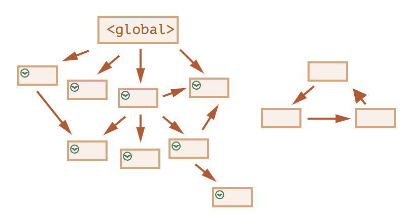

自我介绍
个人项目里面的技术难点，会围绕业务来问问题，所以技术栈及其拓展要熟悉！
实习经历着重准备！！！！
挑战性的工作？
思考为什么要用某个技术，别的不可以吗？
redis

JWT：Header(头部).Payload(负载).Signature(签名)，JWT默认不加密，不要在payload中放隐私信息！

注册：用户提供用户名、邮箱、密码，后端根据是否是第一次注册来分配权限，只有第一次注册的用户才是管理员，这样可以确保没有办法通过前端发送请求的方式来改变权限，只能在后端数据库中修改！然后将姓名、邮箱、密码、权限存储进数据库，注意，我们用bcrypt算法和一个随机生成的盐值，将密码哈希之后再存入数据库！最后将数据库中的ID、用户名和权限封装成payload，根据这个payload和密钥生成一个JWT，再将JWT存储进签名的cookie中，这样前端在接下来的每次请求时都会自动的带上这个cookie！注意cookie的设置：`httpOnly : true`确保前端无法用`document.cookie`访问，`secure : true`确保只能在https下发送，`signed : true`确保利用密钥为cookie生成了一个签名，这样下次服务端发送请求并带上cookie时，可以通过检查签名来判断cookie是否被篡改过！当然，我们也可以不用cookie，而是直接将JWT传给前端，前端将其存储进local storage，每次发出请求时，将其从local storage中取出并添加到header里面：`Authorization: Bearer <token>`;cookie的好处是更安全，后者的好处是可以跨域！

登陆：用户提供邮箱和密码，通过邮箱找到数据库中存储的哈希之后的密码，还可以得到盐值，用相同的bcrypt算法和盐值再次哈希用户提供的密码，如果与数据库中的密码相同，就登录成功！同上，封装payload，生成JWT，存储进签名的cookie中！

Authentication: verify who a user is;    
Authorization: verify what a user has access to!   

认证：在注册或者登陆之后，前端每次发送请求都会带上cookie，对于某些请求，例如查看个人信息、取消订单、创建商品、修改评论等，需要验证个人信息，在认证的中间件截取cookie和其中的JWT，通过密钥来验证JWT并获得其中的payload！

授权：OAuth 2.0，用户可以用GitHub来登录网站而不暴露自己的账号密码！用户点击使用GitHub登陆 -> 在GitHub登陆页面确认授权 -> 授权成功后跳转回前端，并带上一个code -> 前端把code发给后端 -> 后端用这个code向GitHub请求access_token -> 后端用access_token获得用户信息，就可以继续封装payload，生成JWT....

Redis: Key-Value数据库，读写速度非常快，存储临时的大量的高频的数据，提供缓存和分布式锁的功能

MySQL vs MongoDB: https://aws.amazon.com/cn/compare/the-difference-between-mongodb-vs-mysql/

NCBI PubMed
Entrez
requests，BeautifulSoup
抓取文字：pymupdf, OCR (Python-tesseract)
抓取图片：是否有蒙版mask，有的话就组合蒙版；是否有特定的色彩空间(不是RGB)，转化为RGB
Google Gemini - 多模态，免费，稳定，快